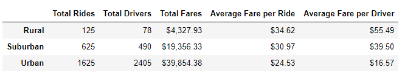

# PyBer_Analysis

## Overview of the analysis
The project will summarize ride-sharing data from 2019/01/01 to 2019/04/29. The summary will provide total riders, total drivers, total fares, average fare per ride and average fare per driver information and group the data into three types, rural, suburban, and urban. Then, the project will showcase weekly fares for each city type by multiple-line chart. Overall, the project will provide a compelling visualization for any disparities among the city types by the summary and multiple-line chart.

## Results
- In Rural, it is total 125 rides, 78 drivers, $4,327.93 total fares, $34.62 average fare per ride and $55.49 average fare per drive during 2019/01/01 to 2019/04/29.
- In Suburban, it is total 625 rides, 490 drivers, $19,356.33 total fares, $30.97 average fare per ride and $39.5 average fare per drive during 2019/01/01 to 2019/04/29.
- In Urban, it is total 1625 rides, 2405 drivers, $39,854.38 total fares, $24.53 average fare per ride and $16.57 average fare per drive during 2019/01/01 to 2019/04/29.

- Urban has highest total fare, Suburban is the second and Rural is the lowest during every week of 2019/01/01 to 2019/04/29.
- The total fares amount fluctuates weekly in each city types. 
- Rural has the highest fares, around $300, in beginning of April and has lowest fares, less than $100, in mid of January.
- Suburban has the highest fare, around $1400, in late Feb and has lowest fares, around $700, in the beginning of January.
- Urban has highest fares, around $2500, in late Feb and early Mar and has lowest fare, around $1600, in the beginning of January. 

## Summary
From the result above, here are recommendations for each city type:
1. In Rural, the average fare per ride ($34.62) and per drive ($55.49) is the highest of three, however; there are too few rides, merely 125 rides in four months. Therefore, we should do some marketing research to figure out how to have more customers using the riding service, such as having some advertisement.

2. In Suburban, all the results are in the middle, which means it is not the highest and not lowest. However, unlike the other two city types, its weekly fares increase sharply from early April. We should look into the data to see what reason simulated riding in April.

3. In Urban, although it has the highest total fares ($39,854.38), the average fare per ride ($24.53) and per drive ($16.57) is the lowest. We could investigate low-fare riding data to figure out what is the reason makes riding fare low, such as the length of riding distance is too short. At the same time, this will also help us to evaluate if we should adjust current pricing strategy to increase fares.
